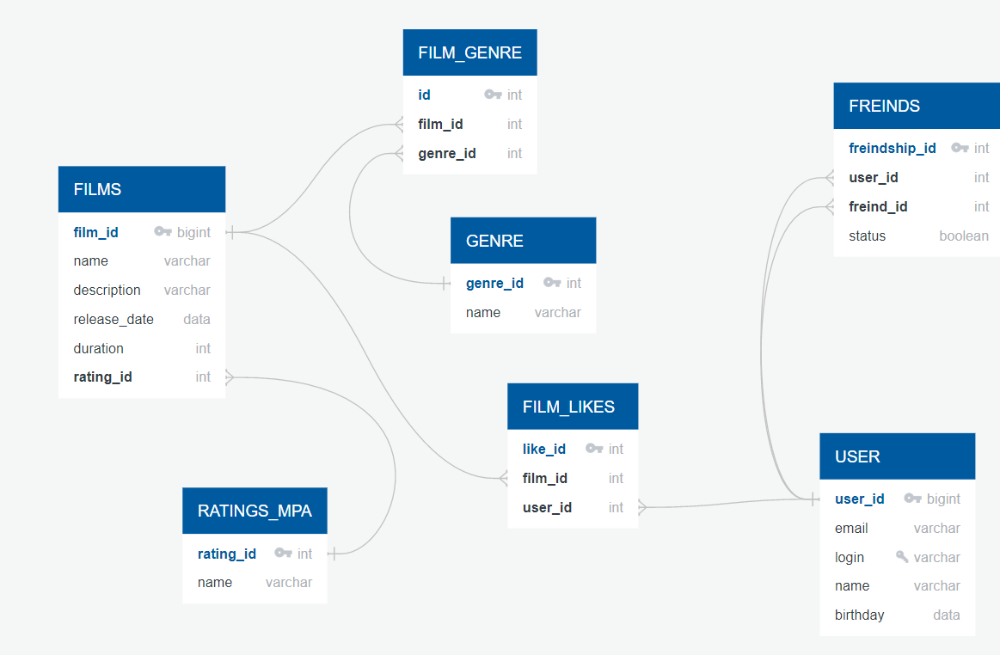

# Java movie selector
Бекэнд социальной сети, которая поможет выбрать кино на основе того, какие фильмы вы и ваши друзья смотрите и какие оценки им ставите

## Возможности приложения:

* создание, обновление фильмов;
* возможность отметки понравившихся фильмов;
* вывод лучших фильмов (в зависимости от количества лайков);
* создание и обновление пользователей;
* добавление пользователей в друзья;
* удаление пользователей из друзей.

### Модель базы данных представлена на ER-диаграмме

---


### Примеры запросов в базу данных

---

<details>
  <summary>Получить фильм с id=2</summary>

```sql
    SELECT *
    FROM films
    WHERE film_id = 2;
```

</details>  

<details>
  <summary>Получить пользователя с id=5</summary>

```sql
    SELECT *
    FROM users
    WHERE user_id = 5;
```

</details>  


<!-- Оформление диаграммы БД посмотрела, хорошая работа! Но, мне кажется, для таблиц friends, film_likes и film_genre лучше сделать комплексные первичные ключи (оба поля: *_id)
